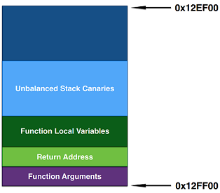
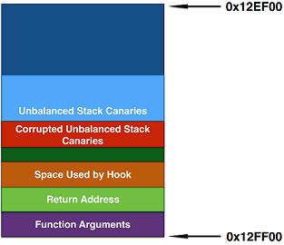

# Defeating Sandbox Evasion

### How to Increase Successful Emulation Rate in Your Virtual Environment

# Abstract

Sandboxed environments are commonly used today to automatically analyze malware behavior. Most modern malicious applications use detection techniques to avoid behavior analysis monitoring by these environments.
We will describe the most interesting ways to detect and evade Cuckoo Sandbox [1], which is the leading open source automatic malware analysis system. As it is used by the largest players on the market, such as Virus Total and Malwr, as well as in internal malware-related projects, results produced with fake information can be critical. At the same time, we will propose fixes for discovered flaws.
InviZzzible [2], a user-friendly tool that can be used for virtual environment assessment, is briefly described as well.
All virtual environment detection techniques with proposed fixes are omitted from the article and can be found on the project's GitHub page.

# Cuckoo Sandbox Environment Detection & Evasion Techniques

Let's describe the most interesting implementation flaws in the Cuckoo Sandbox product.
The rest of Cuckoo Sandbox detection techniques, as well as their fixes, can be found in the source code of InviZzzible and in the presentation slides [3].

## Management of Injections

To better understand some of the described techniques, let's take a look at the simplified architecture Cuckoo uses for tracking applications.


When an already tracked process spawns a new process, the following actions take place:
1. The *PROCESS2* command is queued to the pipe. The operating system creates a *Process #2* structure.
2. Analyzer fetches the *PROCESS2* command from the pipe with additional data.
3. If the application should be monitored, then Analyzer starts the helper inject application with specific arguments and adds PID to the `process_list`.
4. The inject application loads and initializes the Cuckoo Monitor DLL inside the *Process #2* using the `QueueUserApc` or `CreateRemoteThread` functions.

Implementation details that lead to detection and evasion techniques are described later.

## Unbalanced Stack


One of our favorite detections is a technique called Unbalanced Stack.
It can be applied to any type of user mode function hooking that wraps the call to original function, controlling both input and output. This technique is used by the Cuckoo Monitor as well.
Unfortunately, using such hooks leads to detection by storing canaries at the top of the stack.

The program's behavior in the absence of function hooks is presented below.



Let's take a look at the actions a malicious application  takes to determine if it is running in Cuckoo:
1. Store function arguments on the stack.
2. Adjust the stack pointer toward lower addresses on the space for the function return address and the function local variables.
3. Store the Unbalanced Stack Canaries under the stack pointer. It can be any magic value we will check later, i.e.  *0xDEADBEEF*.
4. Restore the original stack pointer value and perform a function call.

If the function is not hooked, the return address and local variables occupy the reserved space on the stack.
It means that Unbalanced Stack Canaries are not affected by the function call.


However, if a function is hooked by Cuckoo, this can be easily detected by the malicious application if it goes through the following steps (after the hooked function is called):
1. Use some space on the stack for the hook local variables.
2. Call the original function that uses reserved space on the stack.

After returning from the function, the malicious application checks the Unbalanced Stack Canaries for integrity. However, in such a situation, the canaries are corrupted.

```
#define ORF_RA OriginalFunctionReturnAddressSize
#define ORF_LV OriginalFunctionLocalVariablesSize
#define HKF_RA HookedFunctionReturnAddressSize
#define HKF_LV HookedFunctionLocalVariablesSize

ORF_US = ORF_RA + ORF_LV ; Reserved Space
HKF_US = HKF_RA + HKF_LV + ORF_RA + ORF_LV ; Space Used When Function Is Hooked

HKF_US > ORF_US ? => HKF_RA + HKF_LV > 0 ? => 4 + HKF_LV > 0, HKF_LV >= 0 ? => YES
```

The image with corrupted Unbalanced Stack Canaries is attached below:




There are multiple solutions that may fix the described detection:
- Use kernel mode hooking.
- Allocate space on the heap in the hook, which will be used as a stack.
- Adjust the stack pointer in the hook to be on a lower address than the Unbalanced Stack Canaries.

## Evasive Thread in Suspended Process


When the monitored process spawns a child process in the suspended state, Analyzer injects Cuckoo DLL and queues APC [4] to the main thread.
This APC is responsible for initializing the injected DLL. The main thread should be resumed to execute the APC.
If we try to interact with the created process, Analyzer will ignore all the operations, because the PID of the created process is already present in Analyzer's `process list`.
So what if the main suspended thread is never resumed?
The answer is straightforward: Cuckoo DLL will not be initialized inside the process. Thus if we can execute code inside the created process without resuming the thread, the Cuckoo environment will be evaded.


Of course, we have a possibility of code execution without resuming the main thread.
For that purpose, we write malicious code to the process space and start it, using the `CreateRemoteThread` routine.
As the Analyzer already contains the process PID we interact with in the `process_list`, these operations are ignored.

A piece of pseudocode is attached below:

```
HANDLE hProc;
PVOID start_addr;

hProc = CreateProcessA(app_name, NULL, NULL, NULL, FALSE, CREATE_SUSPENDED, NULL, NULL, &si, &pi);
start_addr = InjectCode(hProc, code);
CreateRemoteThread(hProcess, NULL, 0, start_addr, NULL, 0, NULL);
```

## ProcessID Reuse


As mentioned previously, the Analyzer holds a `process_list` for tracking the monitored processes.
As PIDs are added to that list, they should be removed somewhere as well:

```
if pid_check:
  for pid in self.process_list.pids:
    if not Process(pid=pid).is_alive():
      self.process_list.remove_pid(pid)
```

Analyzer checks the process exit code. If it does not equal `STILL_ACTIVE`, then Analyzer removes the PID.


Execution of the code that removes the PID is based on the value of the `pid_check` variable.
If it is not set (it may be simply enforced by enabling the Cuckoo `enforce_timeout` option), then we just spawn processes until we encounter one with a repeated PID.
As that PID is already present in the `process_list`, then no injection operations are performed, and Cuckoo is evaded.
But let's consider more interesting case: `pid_check` is set.
It means that terminated processes are removed from the `process_list`.
Let's take a look at the inject application's code that is responsible for dropping the configuration for the Cuckoo Monitor on the disk.

```
wsprintfW(filepath, L"C:\\cuckoo_%d.ini", pid);

if(MoveFileW(config_file, filepath) == FALSE)
  error("[-] Error dropping configuration file: %ld\n", GetLastError());
```

To detect Cuckoo, the malicious application creates a new process in the suspended state and checks a few times for the presence of the `"C:\\cuckoo_%d.ini" % pid` file.

However, there is more interesting evasion technique. Let's take a look at the `MoveFile` second parameter description [5].

```
The new name for the file or directory. The new name must not already exist.
```

As it is clearly stated, the new filename `"C:\\cuckoo_%d.ini" % pid` must be absent from the disk. But if it is present, the `MoveFile` function returns `FALSE` and the injection process is terminated.
The configuration file is removed only after DLL initialization, so we can create processes with the `CREATE_SUSPENDED` state in an infinite loop, until we encounter a repeated PID.

When the process with a repeated PID is created (for example `666`), the inject application tries to drop the `"C:\\cuckoo_666.ini"` file on the disk. However, such a file is already present, so the executable that is responsible for injections is terminated. This process can perform any actions, because it is not monitored by Cuckoo.

## Dead Analyzer


Analyzer contains an instance of `PipeHandler` that is responsible for handling commands coming from the Cuckoo Monitor module.
When the command is queued to the pipe, Analyzer fetches it and performs some actions.
Furthermore, this architecture is responsible for managing injections. So what happens if Analyzer is dead?
It turns out that we can perform any malicious activities in the system, because injections are not monitored and managed at all.


The Analyzer module is started by the Agent. As they are both `python` applications, we can look for the parent/child pairs in the process tree, where both parent and child are `python` executables.
After finding such a pair, the child process is terminated. Thus we have a quite high probability that it was Analyzer in the Cuckoo environment.

## Task Scheduler


The next evasion technique is related to the Windows feature called Task Scheduler [6].
Creating tasks in the system is not monitored by Cuckoo at all.


The malicious process adds the new task to the Tasks Database, after which this task is started.
The Cuckoo Monitor DLL is not injected to the created task, so it can perform any malicious activities that will not be visible in the report.

## Whitelisted Process


The Cuckoo Monitor DLL contains an entry point that is responsible for initializing the tracking module inside the application.

```
if (dwReason == DLL_PROCESS_ATTACH && is_ignored_process() == 0) {
  monitor_init(hModule);
  monitor_hook(NULL, NULL);
  pipe("LOADED:%d,%d", get_current_process_id(), g_monitor_track);
}
```

Everything looks fine, except for the `is_ignored_process` call. If the returned value is not equal to 0, the initialization procedure is not executed, and thus the process is not monitored.


If the executable module name equals to one of the names presented below, then `is_ignored_process` returns a value of 1.

```
"C:\\WINDOWS\\system32\\dwwin.exe"
"C:\\WINDOWS\\system32\\dumprep.exe"
"C:\\WINDOWS\\system32\\drwtsn32.exe"
```

Pseudocode that chooses one of the whitelisted module names and injects malicious code there, thus evading Cuckoo, is presented below.

```
HANDLE hProcess, hThread;

hProcess, hThread = CreateProcess(ChooseProcNameFromWhitelist(), CREATE_SUSPENDED);
InjectMaliciousCode(hProcess);
ResumeThread(hThread); // DllMain will not initialize Cuckoo Monitor due to executable module name
```

# InviZzzible

InviZzzible is a tool for assessing your virtual environment in an easy and reliable way.
It covers the most recent and up to date detection and evasion techniques as well as provides fixes for them.
To add basic detection, only the configuration file should be changed An example of a new detection technique by registry key is presented below.

```
"ControlSet001 Enum": {
  "description": "Check if HKLM\\ControlSet001\\Enum subkeys have specific value.",
  "countermeasures": "Patch HKLM\\ControlSet001\\Enum subkeys.",
  "type": "registry",
  "enabled": "yes",
  "arguments": {
    "check": "contains",
    "recursive": "yes",
    "hkey": "HKLM",
    "key": "SYSTEM\\ControlSet001\\Enum",
    "value_name": [ "DeviceDesc", “FriendlyName" ],
    "value_data": "VMware"
  }
}
```

As of now, the following environments are covered:
- Cuckoo Sandbox (many new evasion and detection techniques)
- VMWare
- VirtualBox
- Generic

The report module supports a few output interfaces:
- Report - A user-friendly, colorful HTML page with a description of detection techniques and advice on how to fix the environment.
- Console - With additional debugging information if needed.
- Domains - Domain names are composed using a format that is easy to parse.
- Files - File names are composed using a format that is easy to parse.

For more information, please visit the project's GitHub page.
You are free to add new, or modify existing, evasion and detection techniques.

# Acknowledgments

We would like to thank our colleagues Aliaksandr Trafimchuk and Alexey Bukhteyev for helping us with our project.

# References

* [^1] https://github.com/cuckoosandbox
* [^2] https://github.com/CheckPointSW/InviZzzible
* [^3] https://github.com/CheckPointSW/InviZzzible/blob/master/conferences/Skuratovich_Chailytko-DefeatingSandboxEvasion.pdf
* [^4] https://msdn.microsoft.com/en-us/library/windows/desktop/ms681951(v=vs.85).aspx
* [^5] https://msdn.microsoft.com/en-us/library/windows/desktop/aa365239(v=vs.85).aspx
* [^6] https://en.wikipedia.org/wiki/Windows_Task_Scheduler

#### Metadata

**Tags**: sandbox evasion, sandbox detection, Cuckoo Sandbox, virtual environment detection, virtual environment

* **Primary Author Name**: Stanislav Skuratovich
* **Primary Author Affiliation**: Check Point Software Technologies
* **Primary Author Email**: stanislavsk@checkpoint.com
* **Additional Author Name**: Alexander Chailytko
* **Additional Author Affiliation**: Check Point Software Technologies
* **Additional Author Email**: alexanderc@checkpoint.com
