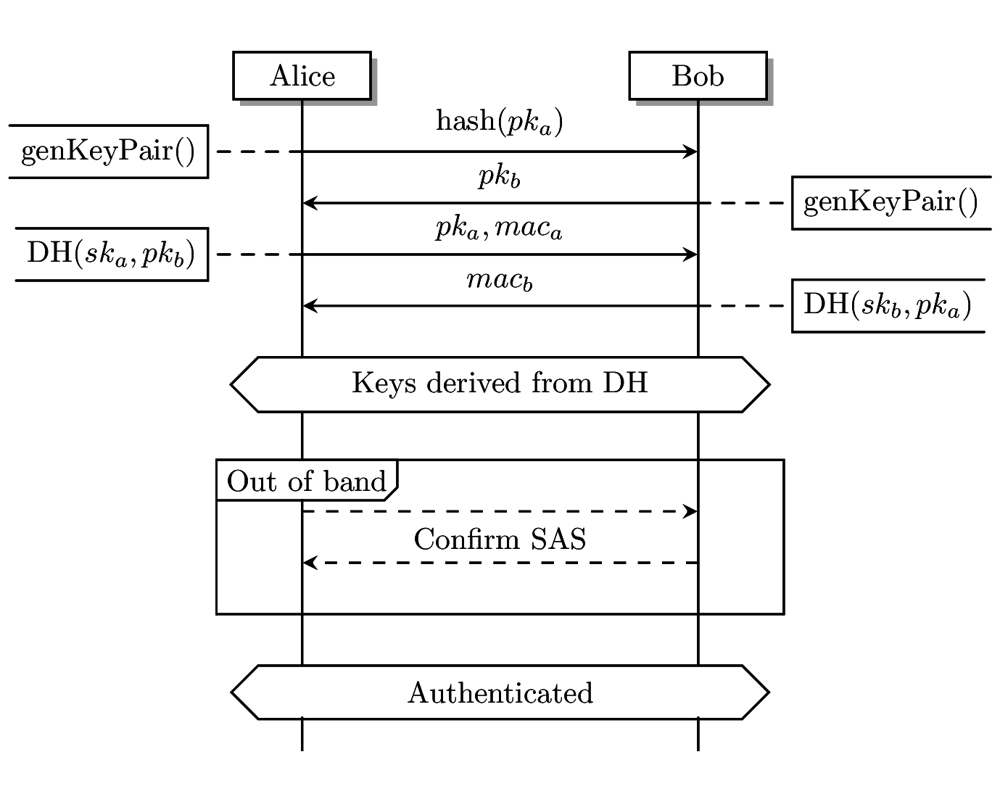
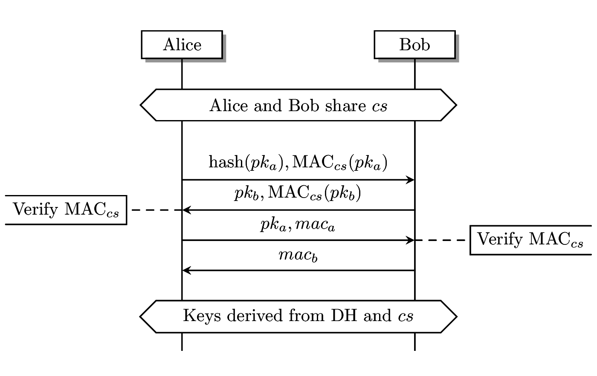
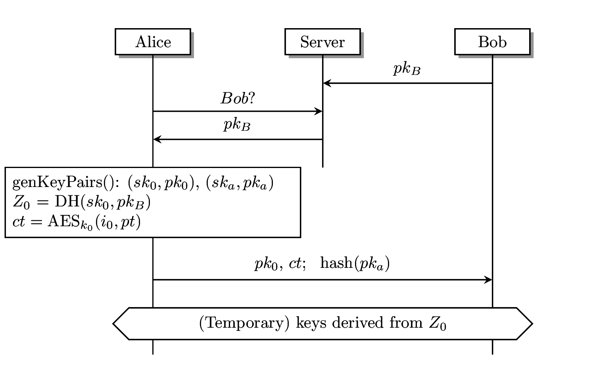

# (In-)secure messaging with SCIMP and OMEMO

## Abstract

Many secure end-to-end messaging protocols exist in the wild, most of
which claim to provide the same basic security properties.  However,
each protocol exists in a different context and has different
requirements to fulfill.  The protocol and the security that is
achieved is not independent of that context.  In particular, we take a
look at the Silent Circle instant messaging protocol (SCIMP), the
former default messaging protocol on the BlackPhone.  We construct a
model of the protocol using the formal verifier ProVerif, with which
we prove that version one of the protocol is secure and we find a
man-in-the-middle attack against version two.  By comparing the model
against the actual implementation we find a discrepancy that allows an
attacker to perform the attack completely undetected.  A similar
situation arises in OMEMO (an multi-device XMPP implementation of the
Signal protocol), which did not achieve the full potential security
when deployed in a multi-device setting.  Both protocols have been
patched and should no longer be vulnerable against the found attacks.

## Secure Messaging Protocols

Secure messaging has been around for a long time, yet there is much
active development in the field.  The main reason is an increasing set
of requirements that these protocols should fulfill.  Besides the
basic end-to-end encryption providing *confidentiality* and
*authenticity*, we want the protocols to support *key-erasure* (also
known as forward secrecy), *deniability* and *future secrecy*
(sometimes advertised as the self-healing property).  Many of these
features were introduced by the Off-the-record (OTR) protocol [^3].

This work presents the analysis of two protocols, namely the Silent
Circle instant messaging protocol (SCIMP) [^6] and OMEMO [^9], which
is a multi-device XMPP implementation of the Signal protocol [^7].
Both protocols/implementations contained vulnerabilities, although in
both cases a fix has been provided by the developers: while SCIMP has
been discontinued in favor of an adaptation of the Signal protocol,
the patched version of SCIMP is currently being considered for
standardization in XMPP.  More detailed reports of these results have
been made available online, see [^4] - [^10] - [^12].

## Formal verification

We specified SCIMP in the formal language of ProVerif [^2], which
provides a mathematical model of the protocol.  Then we ask the tool
to prove several theorems about that model, such as its correctness,
the confidentiality of data and/or keys and the authenticity of
received messages.  The tool outputs either that no attack is possible
(in the model) or it reports a possible vulnerability.

The value of security proofs (both those using formal verifiers and
pen-and-paper proofs) has been subjected to much debate in the
security community.  To evaluate the real-world impact of a successful
verification, we need to check how closely the model describes the
actual implementation, if the attacker model accurately describes the
real-world adversary capabilities and if the context in which the
protocol is deployed meets the assumptions of the model.  A negative
result is often much easier to interpret: it provides vulnerabilities
which could be expoited by a real-world adversary.

### ProVerif

ProVerif applies the Dolev-Yao attacker model to the specified model,
meaning that the attacker is able to inject, alter and drop any
messages send over a public channel.  It does not consider, for
example, side-channel attacks.  The full ProVerif models for SCIMP are
available on GitHub [^11].

## SCIMP

SCIMP was initially released in the Silent Text application [^8], the
default messaging application of the BlackPhone.  The protocol is an
XMPP implementation of SecureSMS [^1].  After an initial ephemeral key
exchange the users share key material which they can use to
authenticate each others identity and to send private messages.

### Version 1

Alice and Bob initially execute an ephemeral elliptic-curve
Diffie-Hellman key exchange, which provides them with a shared secret.
With a key-derivation function (KDF) they derive a number of values:
keys for encryption, MAC values to check that the other party
completed their part of the key exchange, a short authentication
string (SAS) for authenticating the other party and a cached secret
(CS) for rekeying.

The short authentication string is required because ephemeral
Diffie-Hellman is vulnerable to a trivial man-in-the-middle attack,
therefore the users must compare the SAS out-of-band.  By initiating
the key exchange with a commitment to the public key of Alice, the
adversary is given only a single guess at a key that results in a
SAS-collision, so that the SAS can be short (easy for humans to
compare) while still remaining secure.

SCIMP also considers security after a key was compromised.  By
renegotiating keys, the keys are renewed and security is restored,
assuming the adversary did not compromise the rekeying itself.  By
mixing the CS into the KDF, the users do not have to compare the SAS
again.

Sending private messages is done by symmetric encryption using the
derived keys.  After each sent/received message, the corresponding
key is ratcheted forward with a MAC function.

Our ProVerif model consists of the key exchange, rekeying and sending
user messages.  The tool proved that SCIMP version 1 meets all
described security requirements.

### Version 2

SCIMP version 1 does not allow offline initial messages (Alice wants
to message Bob while his phone is off), so version 2 was released May
2014 [^5], although the source-code was not released until August 2015
[^8].  It introduced "progressive encryption", in which the server
keeps a cache of Bobs half of the key negotiation.  Alice completes
her half to derive a temporary key to encrypt messages and initiates
another (version 1) key exchange in parallel, after which a
SAS-comparison confirms the identity of the other party.

For version 2 we created a ProVerif model for the updated key
exchange.  The tool reported that the first message can be
compromised.  In order to assess the impact of this vulnerability, we
inspected the code to see how an adversary would be able to trigger
this vulnerability.

We found that the adversary can extend its man-in-the-middle position
undetected as long as the parallel key negotiation was not completed.
By inspecting the plaintext tag on each message all key exchange
messages can be blocked.  Vigilant users might detect this (since they
would expect to get a SAS after at most four user messages).  However,
a second implementation bug allows a complete compromise after the SAS
was confirmed by the users.  When receiving an out-of-order (re)keying
message, the code only inspects the message tag before aborting.  The
code then overreacts and also deletes all local key material, thereby
anulling any security set up in the past.  A new key negotiation is
required which can be compromised.

The code inspection uncovered more vulnerabilities in the
implementation.  We reported our findings to Silent Circle, most of
which were fixed by their September 2015 migration to a Signal-based
protocol.  However, some of the vulnerabilities were still present in
the copy-pasted code that was in use until July 2016 when we reported
our findings [^4], after which it was fixed within a few days.

## OMEMO

OMEMO is an XMPP implementation of the Signal protocol.  It allows
multiple devices in one conversation.  The Signal application does
this by sharing the private key between devices, while in OMEMO each
device has its own key.  In OMEMO, pairwise Signal sessions are set up
between each device.  User messages get encrypted/authenticated with a
random key.  That key is sent to each device inside the Signal session
and the encrypted/authenticated user message is sent outside that
session.  I analyzed the security of this solution and found a
vulnerability [^10].

When a single device in a conversation is compromised, confidentiality
can no longer be guaranteed.  However, messages from non-compromised
devices should still be authentic.  However, with the initial OMEMO
solution, a compromised device can encrypt arbitrary messages once it
has received the random key.  Therefore, an authentication tag of the
user message should be send to each user inside the Signal session.
This solution was implemented in an updated version of OMEMO the same
day that I reported the vulnerability.

## Conclusions

Implementing modern secure messaging protocols is not always
straightforward.  Extending existing solutions to include more
functionality can compromise security in surprising ways.  Even
cryptographic experts do not always get it right.  Luckily there are
tools such as ProVerif which can help us to analyze the protocols and
expose flaws.  Even with these tools, there remains a gap between the
security of a protocol as specified and the security of the
implementation.  Therefore, I would love to see more powerful tools
that can extract a model from the code.

## References

[^1] Belvin, G. (2011). A Secure Text Messaging Protocol (Masters thesis).  <https://eprint.iacr.org/2014/036>

[^2] Blanchet, B. (2016). ProVerif: Cryptographic protocol verifier in the formal model. <http://prosecco.gforge.inria.fr/personal/bblanche/proverif/>

[^3] Borisov, N., Goldberg, I., Brewer, E. (2004). Off-the-Record
     Communication, or, Why Not to Use PGP. In Proceedings of the 2004
     ACM Workshop on Privacy in the Electronic Society, pages 77-84.

[^4] Lange, T., Verschoor, S. R. (2016). (In-)Secure messaging with
     the Silent Circle instant messaging protocol.
     <https://eprint.iacr.org/2016/703>

[^5] Moscaritolo, V. (2015). Silent Text 2.0: The next generation of
     private messaging.
     <https://web.archive.org/web/20150506152939/https://blog.silentcircle.com/silent-text-2-0-the-next-generation-of-private-messaging/>

[^6] Moscaritolo, V., Belvin, G., Zimmermann, P. (2012). Silent Circle
     Instant Messaging Protocol - Protocol Specification.
     <https://github.com/SilentCircle/silent-text/blob/master/Documentation/>

[^7] Open Whisper Systems. Technical documentation.
     <https://whispersystems.org/docs/>

[^8] Silent Circle (2015). Encrypted text messaging.
     <https://github.com/SilentCircle/silent-text>

[^9] Straub, A. (2016). XEP-0384: OMEMO Encryption. XMPP Standards
     Foundation.  <https://xmpp.org/extensions/xep-0384.html>

[^10] Verschoor, S. R. (2016). OMEMO: Cryptographic Analysis Report.
     <https://conversations.im/omemo/audit.pdf>

[^11] Verschoor, S. R. (2016). ProVerif models for SCIMP.
     <https://github.com/sebastianv89/scimp-proverif>

[^12] Verschoor, S. R. (2016). Secure messaging in mobile environments
     (Masters thesis).  <http://repository.tue.nl/844313>

#### Metadata

Tags: SCIMP, Silent Circle, OMEMO, XMPP, Instant Messaging Protocol

* **Primary Author Name**: Sebastian R. Verschoor
* **Primary Author Affiliation**: University of Waterloo
* **Primary Author Affiliation**: Eindhoven University of Technology
* **Primary Author Email**: <sebastian@zeroknowledge.me>
